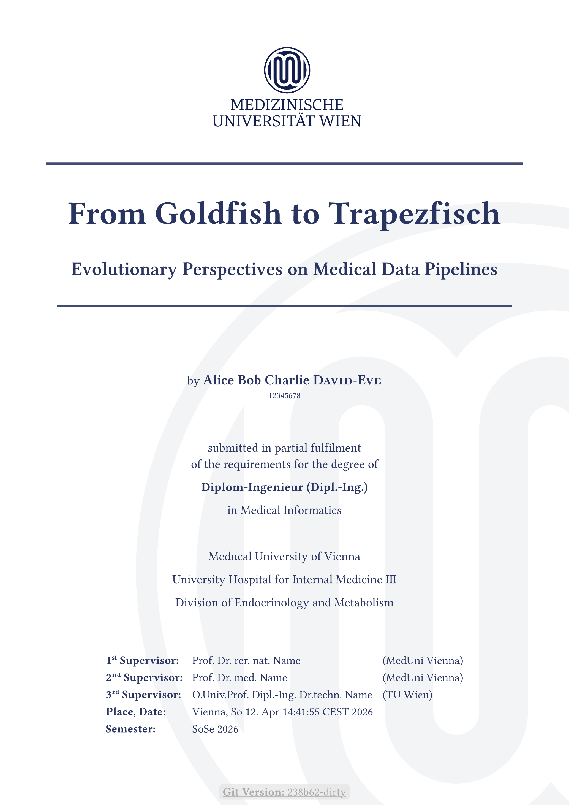

# muw-thesis

Medical University of Vienna thesis template

### see [example pdf](./thesis-out.pdf)



> [!NOTE]
> This is not an official template<!--, but it is based on one-->.
> The target audience is primarily medical informatics graduates from MedUni,
> but this template can also be used for medicine, dentistry or molecular precision medicine.
> It should also be fairly easy to adapt for doctoral programmes or PhDs.
> 
> - https://www.meduniwien.ac.at/web/studierende/service-center/meduni-wien-vorlagen/
> - https://www.meduniwien.ac.at/web/studierende/mein-studium/masterstudium-medizinische-informatik/masterarbeit/
> - https://ub.meduniwien.ac.at/fileadmin/content/OE/ub/dokumente/MusterfuerAbschlussarbeit2025.docx
> - https://www.meduniwien.ac.at/web/studierende/mein-studium/diplomstudium-humanmedizin/diplomarbeit/
> - https://ub.meduniwien.ac.at/services/plagiatspruefung/
> - https://www.meduniwien.ac.at/web/fileadmin/content/serviceeinrichtungen/studienabteilung/studierende/MPM_UN_066_329/PDF/Leitfaden_Masterarbeit_de.pdf
> - https://www.meduniwien.ac.at/web/fileadmin/content/serviceeinrichtungen/studienabteilung/studierende/humanmedizin/pdf/PDFA-Leitfaden_V5.2.pdf


## Building

Build the thesis using `make`:

```bash
make
```

### Typst Backend Selection

You can select which Typst backend to use by setting the `TYPST_BACKEND` variable:

- **nix** (default): Uses Nix to run Typst
  ```bash
  make TYPST_BACKEND=nix
  ```

  You can also specify a different Typst version when using nix:
  ```bash
  make TYPST_BACKEND=nix TYPST_VERSION=ec2389e
  ```

- **docker**: Uses Docker with the official Typst image
  ```bash
  make TYPST_BACKEND=docker
  ```

- **local**: Uses locally installed Typst
  ```bash
  make TYPST_BACKEND=local
  ```

### Other Targets

- `make watch` or `make w`: Watch for changes and recompile automatically
- `make open` or `make o`: Open the generated PDF
- `make clean` or `make c`: Remove generated PDF
- `make thumbnail`: Generate PNG thumbnails of specific pages
- `make check`: Run typst package check


## typst package requirements

```sh
grep -rho '@preview/[^"]*' ./thesis/**/*.typ | sort -u
```

```txt
@preview/bookly:1.0.0
@preview/bookly:1.1.2
@preview/bookly:2.0.0
@preview/cheq:0.2.2
@preview/curryst:0.5.1
@preview/equate:0.3.2
@preview/glossarium:0.5.10
@preview/grape-suite:3.1.0
@preview/lemmify:0.1.8
@preview/meander:0.4.2
@preview/nth:1.0.1
@preview/quick-maths:0.2.1
@preview/shadowed:0.2.0
@preview/tablem:0.2.0
@preview/zebraw:0.5.5
```

